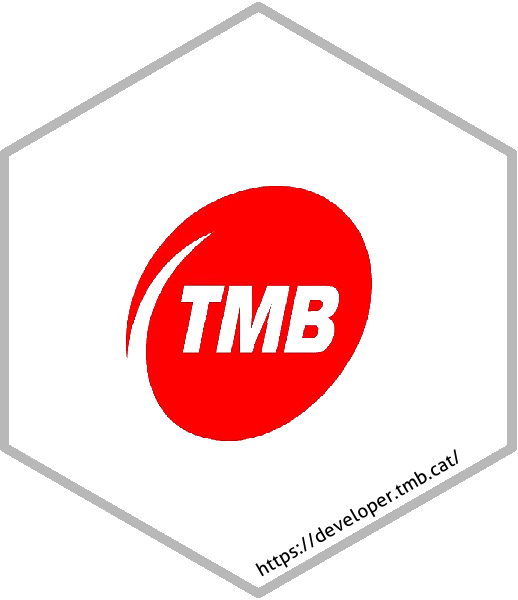

# TMB package </a>

<!-- badges: start -->
[](https://www.tidyverse.org/lifecycle/#experimental)
[](https://opensource.org/licenses/MIT)
[](https://github.com/xavivg91/TMB/issues/new)
[](http://hits.dwyl.com/xavivg91/TMB)

[](https://github.com/xavivg91/)
[](https://twitter.com/Xavier91vg)
<!-- badges: end -->

## Introduction 

[TMB](https://www.tmb.cat/en/home) (_Transports Metropolitans de Barcelona_) is the main public transport operator in Catalonia and a benchmark public mobility company in Europe and the world.

## Overview

The TMB package opens a connection to the [TMB API](https://developer.tmb.cat/) to retrieve data related to the bus and metro service in Barcelona.

## Installation

```R
# install.packages("devtools")
devtools::install_github("xavivg91/TMB")
```
## Usage

`library(TMB)` will load the following core functions:

* `bus.stops()`, for the bus stops and lines in Barcelona.

```R
# Without the line argument, the function retrieves data from all bus stops
bus.stops(app_id, app_key)

# Bus stops corresponding to the specified line
bus.stops(app_id, app_key, line = c(6, 7, 11, 13, 19, 21, 22, 23, 24, 27, 33, 34, 39,
                                    46, 47, 52, 54, 55, 59, 60, 62, 63, 65, 67, 68,
                                    70, 75, 76, 78, 79, 91, 94, 95, 96, 97, 100, 101,
                                    102, 103, 104, 107, 109, 110, 111, 112, 113, 114,
                                    115, 116, 117, 118, 119, 120, 121, 122, 123, 124,
                                    125, 126, 127, 128, 129, 130, 131, 132, 133, 135,
                                    136, 150, 155, 157, 165, 185, 191, 192, 196, 201,
                                    202, 203, 204, 205, 206, 207, 208, 209, 210, 211,
                                    212, 213, 214, 215, 216, 217, 219, 220, 221, 223,
                                    225, 227, 229, 231, 233, 240, 250))
```                         

* `metro.stations()`, for the metro stations and lines in Barcelona.

```R
# Without the line argument, the function retrieves data from all metro stations
metro.stations(app_id, app_key)

# Metro stations corresponding to the specified line
metro.stations(app_id, app_key, line = c(1, 2, 3, 4, 5, 11, 91, 94, 99, 101, 104))
```  

## How it works

First, you have to register on the TMB API portal and create an application to obtain your credentials `app_id` and `app_key`, you will need these codes to use the TMB package functions. You can check out more information about this quick registration [here](https://developer.tmb.cat/docs/getting-started). You will find the credentials inside the created application. 

Once we have our credentials, let’s say we want to obtain a data set containing the metro stations corresponding to the L2 line. Just grab your credentials and use them as the `metro.stations()` function arguments. You also have to specify the line.

```R
# Load library
library(TMB)

# Metro stations corresponding to the L2 line
metro.stations(app_id = "Copy and paste your app_id here", 
               app_key = "Copy and paste your app_key here",
               line = 2)
```  

Easy peasy, right?

## Data Ownership

All extracted data belong to the [TMB API portal](https://developer.tmb.cat/).
